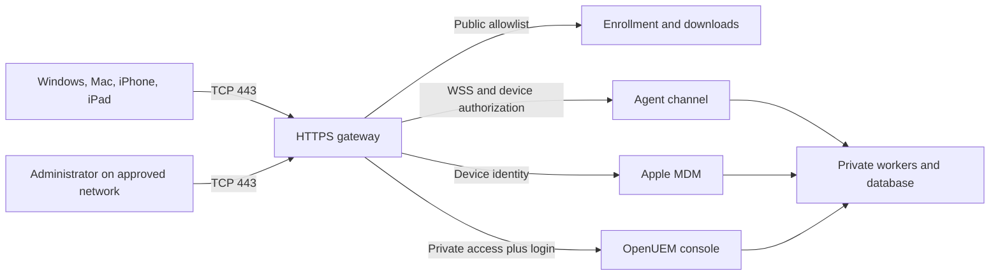

# OpenUEM fork: feature gaps, Fleet comparison and implementation roadmap

Baseline: **7 September 2026**, implementation commit
[`c19a58b`](https://github.com/the-luap/openuem-console/commit/c19a58ba5a54df0f548f8583d0a67cd3da72e30c).
This document preserves the expanded requirements and the findings at that
baseline. It is not a statement that the proposed features already exist.
[Implementation evidence](implementation-status.md) records subsequent changes
and outstanding verification without changing the original scope.

**Language requirement:** the user's subsequent instruction supersedes the
original request for a German interface: documentation, source code, comments,
new interface copy and installation instructions must be in English. Existing
localization infrastructure must remain usable. German is used only in the
conversation with the user. The historical filename remains stable for links.

The baseline review examined the fork's source, primary sources and the running
local test console in a browser. No physical Apple or Windows devices were
connected. Automated protocol evidence must not be described as hardware acceptance.

## 1. Principal findings

- **iPadOS is already represented.** Model detection distinguishes iPads and uses
  the same inventory, profile and update implementation as iPhones. Dedicated
  iPad acceptance, filters and appropriate policy templates are missing.
- **Native macOS MDM is missing.** Check-in rejects Mac models and the release
  catalog processes only the iOS group. The existing macOS agent and Apple MDM
  must join into one device record and management experience.
- **An in-app CSR wizard is required.** Uploading a push certificate and private
  key is the baseline. An ordinary CSR alone cannot be submitted to Apple's MDM
  push portal: an authorized MDM vendor must sign the request.
  [Apple vendor signing requirements](https://developer.apple.com/help/account/certificates/mdm-vendor-csr-signing-certificate)
- **An internal CA is required, but manual OpenSSL administration is not.**
  OpenUEM can create its CA during installation; an existing enterprise CA is
  another option. Provide a straightforward setup wizard.
  [OpenUEM certificates](https://github.com/open-uem/openuem-docs/blob/main/docs/07-Advanced%20Topics/05-certificates.md)
- **One public inbound port, TCP 443, is the deployment target.** Apple MDM,
  agent connections, downloads and administrator authentication need integrated
  routing and authentication; a proxy snippet alone cannot meet the requirement.
- **Login alone does not make administration private.** Deny external access to
  administrator routes at the entry point and enforce sessions, roles and scope
  again in the application.
- **The UI requires consistent components and localization support.** The
  baseline mixes languages and interaction patterns and has reproduced page
  overflow, including on upstream pages. English is now the acceptance language.

Evidence: [platform detection](../internal/mdm/apple/types.go),
[check-in](../internal/mdm/apple/commands.go), [catalog](../internal/mdm/apple/catalog.go),
[Apple UI](../internal/views/mdm_views/pages.templ),
[existing locale catalog](../internal/views/locales/de.yaml).

## 2. Requirement status at the baseline

**Present** means implemented, not necessarily verified on hardware. **Partial**
means there is a foundation with specific missing work. **Missing** means absent
from the reviewed implementation path. **Unverified** means evidence is missing.

| Requirement | Baseline | Required work |
| --- | --- | --- |
| Windows software installation/removal | Existing workflows | Real endpoint acceptance; simple package/agent downloads; consistent status with Apple |
| Windows inventory and installed software | Existing agent | Endpoint acceptance; common filters, exports and compliance |
| Windows configuration | Agent tasks for Registry, MSI, PowerShell, users/groups | Native Windows enrollment, SyncML and CSP are not demonstrated |
| Windows updates | Security/update information | Policies for deadlines, deferrals, restarts and verified results |
| iPhone enrollment | One-use manual link and `.mobileconfig` | Public instructions, QR code, recovery and ADE |
| iPad enrollment | Shared Apple implementation | Physical iPad acceptance; specific policies and filters |
| Apple hardware, OS/build and apps | iOS/iPadOS implementation | Hardware acceptance; explain enrollment-dependent inventory; add macOS |
| Apple configuration profiles | Upload, simple editors, revisions, assignment, removal and reconciliation | Template catalog, target groups, conflict checks and macOS |
| Apple OS updates | DDM version/build/deadline policy for iOS/iPadOS | macOS, rings, groups, useful progress/errors and hardware tests |
| macOS management | Upstream agent | Native enrollment, profiles, DDM, security and agent/MDM identity linkage |
| Apple app distribution | Missing | Apps & Books, licenses, installation status and subsequent self-service |
| In-app CSR | Missing | Key/CSR generation, vendor signature, certificate-only import, renewal and expiry alerts |
| Reverse proxy deployment | Upstream console support | Complete Apple MDM, agent WSS and download routing on one external port |
| Private administration/public devices | Separate Apple and console listeners | Verified external route allowlist, internal administration and blocked direct backends |
| Windows/Mac client link | Upstream installers | Secure, correctly configured installation links generated by the console |
| Apple device setup link | iOS/iPadOS profile link | Guided instructions/status; macOS profile and optional agent package |
| Consistent English experience | Existing localization framework | New pages, validation, formatting, installation help and remaining upstream gaps |
| Responsive unified UI | Common layout | Consistent components, actions, pagination/status; repair measured overflow |
| Security and operations | TLS, device identities, encrypted Apple secrets, sessions/2FA | Proxy trust, granular access, safe bootstrap, rotation, audits, load and attack tests |

Evidence: [Windows deployment](../internal/controllers/webserver/handlers/deploy.go),
[agent profiles/tasks](../internal/controllers/webserver/handlers/profiles.go),
[security reporting](../internal/controllers/webserver/handlers/security.go),
[Apple implementation](../internal/mdm/apple), [console integration](../internal/controllers/webserver/handlers/apple.go).
Agent tasks are distinct from native Windows MDM.
[Microsoft MDM architecture](https://learn.microsoft.com/en-us/windows/client-management/mdm-overview),
[HTTPS, SyncML and CSP](https://learn.microsoft.com/en-us/windows/client-management/windows-mdm-enterprise-settings)

## 3. Fleet comparison and additional scope

This is the recorded comparison with Fleet's offering, including Premium, at the
baseline date. **F** denotes its free offering and **P** Premium. This does not
promise identical coverage on every OS. Publicly visible source may still carry
commercial licensing: inspect each file before reuse.
[Fleet pricing](https://fleetdm.com/pricing), [source and licensing](https://github.com/fleetdm/fleet)

| Fleet capability | Offering | Relevance/gap |
| --- | --- | --- |
| Cross-platform MDM | F | Native iOS/iPadOS foundation; Windows agent; macOS MDM missing |
| Inventory search, labels, policies | F | Common dynamic groups and cross-platform policies |
| OS settings | F | Apple templates and native Windows CSP coverage |
| DDM configuration profiles | F | General declaration catalog beyond OS updates |
| Script execution | F | Existing desktop tasks; common execution history |
| Reports/dashboards | F | Add Apple data and shared compliance to upstream reporting |
| API, webhooks, CLI, GitOps | F | Documented public management API and desired-state workflow |
| SSO | F | Complete OIDC access, roles and organization rights |
| Zero-touch/MDM migration | P | Apple ADE and native Windows enrollment/migration |
| Account-driven Apple BYOD | P | Real User Enrollment, distinct from manual Device Enrollment |
| IdP groups/account synchronization | P | Consistent user-device-group associations |
| Targeted device groups | P | Organizations/sites/tags alone are not equivalent |
| Enforced encryption | P | Complete BitLocker/FileVault policies with recovery escrow |
| Recovery Lock | P | macOS support plus secure secret storage and rotation |
| Enforced OS updates | P | Extend Apple foundation to macOS and Windows |
| Conditional Access | P | Integration based on verified device compliance |
| Software distribution | P | Common catalog and Apple distribution alongside Windows |
| Self-service | P | User catalog of approved applications |
| Automated remediation/maintenance windows | P | Policy → action → evidence workflow |
| Lock and wipe | P | Native Apple actions; implement/test Windows separately |
| Multitenancy/group reporting | P | Isolated permissions and unified reports |
| Agent versions/private update repository | P | Controlled releases, updates and rollback |
| MFA, roles, audit log | P | MFA exists; granular authorization and Apple audit UI missing |
| Certificate distribution/SCIM | P | Cross-platform certificate and user lifecycle |
| Vulnerability assessment/CISA KEV | P | Verified risk and patch prioritization |

Additional desktop security analysis includes live osquery queries, file integrity
monitoring, collection of investigation files, custom logging and YARA/IoC checks.
Plan this separately from core MDM; iPhones/iPads do not provide unrestricted
query or script execution. The baseline pricing page marked application management,
binary authorization and asset discovery as announcements, not universally
available reference implementations. These remain later security-analysis work,
not a reason to defer the initial profile/inventory/deployment workflows.

Relevant platform distinctions and references:

- Apple: manual enrollment and ADE for macOS/iOS/iPadOS, CSR setup and Apps & Books.
  [Apple MDM setup](https://fleetdm.com/guides/apple-mdm-setup)
- Windows: native enrollment and Entra/Autopilot in addition to an agent.
  [Windows MDM setup](https://fleetdm.com/guides/windows-mdm-setup)
- Updates: platform-specific Apple policies, Windows deadlines/grace periods and
  hardware-aware latest macOS release delays. [Update enforcement](https://fleetdm.com/guides/enforce-os-updates)
- Software: custom packages, install/uninstall, Store apps and self-service.
  [Packages](https://fleetdm.com/guides/deploy-software-packages),
  [Store apps](https://fleetdm.com/guides/install-app-store-apps),
  [self-service](https://fleetdm.com/guides/software-self-service)
- Encryption: enforcement, escrow and verification. BitLocker inventory alone is
  insufficient. FileVault applies to Macs; iOS/iPadOS need their own security model.
  [Disk encryption](https://fleetdm.com/guides/enforce-disk-encryption)

## 4. Platform work

### iOS and iPadOS

Retain the shared protocol server while representing iPadOS separately in filters,
icons, reports and policy targets.

1. Show enrollment type and capability explicitly: manual Device Enrollment,
   subsequent ADE and User Enrollment, supervised/unsupervised. Downloading a
   manual profile does not enable supervision.
2. Provide version/platform-aware templates for Wi-Fi, VPN, certificates,
   passcodes, restrictions, web filtering and eligible kiosk/Single App Mode.
   Simple passcode/Wi-Fi/restriction editors and generic upload are only a base.
3. Target organizations, sites and dynamic groups; preview affected devices,
   exclusions and conflicts; roll back revisions and explain device errors.
4. Apply update policies to groups/rings, with a pilot before broad rollout,
   deadlines, exceptions, progress and escalation. Keep active policy distinct
   from installed target version.
5. Renew device certificates automatically before their current one-year expiry,
   preserving enrollment rather than requiring routine re-enrollment.
6. Implement ADE/Apple Business integration, token renewal, assignment, Setup
   Assistant and re-enrollment. Connection/token synchronization, immutable profile
   publication, signed admission, re-arming and reported MDM setup release are
   tracked in [ADE implementation evidence](apple-automated-enrollment.md).
   Groups/rings, directory and managed account setup, and physical acceptance
   remain outstanding.
7. Add real account-driven User Enrollment for later BYOD, with restricted
   inventory and transparent separation of personal data.
8. Subsequently add Apps & Books, license assignment, app updates and self-service.
   Plan and test Shared iPad separately.

Inventory can show only what Apple reports for the enrollment type. Do not promise
all private apps, particularly with User Enrollment.
[BYOD inventory limits](https://fleetdm.com/guides/enroll-byod-ios-ipados-hosts),
[Apple device-management schemas](https://github.com/apple/device-management)

### macOS

macOS is an additional implementation block with its own capabilities. Existing
agent inventory, scripts, Homebrew and Ansible are useful foundations. The current
manual configuration/certificate steps do not meet simple onboarding.
[Upstream macOS agent installation](https://github.com/open-uem/openuem-docs/blob/main/docs/02-Installation/02-Agent/03-macos.md)

1. Accept and correctly detect Mac enrollment in the native module, persist a
   platform/version capability model and extend catalog processing beyond iOS.
2. Link agent and MDM using stable hardware identifiers: one Mac/detail page, two
   management channels. Handle conflicts and re-enrollment without duplicates.
3. Support macOS profiles and appropriate device/user channels, clearly distinct
   from existing Ansible tasks.
4. Implement DDM updates using the Mac catalog, hardware compatibility and required
   authorization/bootstrap-token workflows. Derive and test minimum OS versions
   from Apple's schemas.
5. Implement FileVault with escrowed and verified recovery keys; subsequently
   Recovery Lock, local administrator accounts/password rotation and Platform SSO.
6. Add PPPC/TCC, System Extensions, Firewall, Gatekeeper and certificate templates.
   Do not claim that MDM can bypass every user approval.
7. Produce a signed, notarized agent package, English link-based installation and
   automatic configuration. Verify the actual release signature; the baseline
   upstream instructions mention unsigned packages.
8. Unify Homebrew, custom PKG packages and subsequent Apps & Books with verifiable
   installation and removal results.

### Windows

Preserve existing deployment. A new native MDM server is unnecessary merely to run
WinGet/MSI/PowerShell tasks, but remains necessary for the requested native MDM depth.

1. Generate approved installation links with automatic organization/site placement
   and individual identities; users must not gather certificate files manually.
2. Provide one catalog for standard and custom packages: version, source,
   architecture, parameters, detection rule, uninstallation, reboot and outcome.
3. Distinguish pending, downloaded, installed, verified and failed; test offline
   endpoints, retries and package replacements.
4. Add update rings, deadlines, deferrals and restart communication. Reports alone
   must not be presented as full patch management.
5. Extend BitLocker inventory into enforcement and recovery-key escrow with
   controlled retrieval; add useful Defender, Firewall and local-admin state.
6. Implement native discovery/enrollment, certificate issuance, DMClient/SyncML,
   CSP results, renewal and unenrollment. Entra/Autopilot are separate integrations
   built on that path and need their own acceptance.
7. Define supported versions, editions and architectures; identify Windows Server
   and end-of-support systems separately.

The built-in MDM client and OpenUEM agent are different management channels. The
agent remains useful for Win32 deployment and detailed management.
[Microsoft MDM](https://learn.microsoft.com/en-us/windows/client-management/mdm-overview)

## 5. Apple push certificate wizard

The baseline imports a certificate/key pair, validates matching key, MDM topic
and validity, encrypts keys and prevents topic changes during renewal. Add:

1. **Set up Apple management:** confirm organization and public device origin.
2. **Create certificate request:** generate and encrypt the private key in the
   instance; produce the public CSR. Never send the private key to a signer.
3. **Obtain vendor signature:** support an authorized in-house Apple MDM vendor
   credential or an authorized signing service. Establish its availability,
   contract and operations. A community fork has no implicit access to Fleet's
   signing infrastructure.
4. **Download request for Apple:** provide an actual vendor-signed portal request,
   open the Apple portal in a new tab and give English next-step instructions.
5. **Upload Apple certificate:** require only the returned certificate, associate
   it with the stored key, validate contents/expiry/topic and test connectivity.
6. **Renew the existing certificate:** warn before expiry, record the responsible
   Apple account as administrative metadata, guide selection of the existing portal
   entry, prevent topic changes and preserve the working configuration until the
   replacement passes validation.

A raw PKCS#10 CSR is not a completed MDM portal application. Only authorized
administrators can manage requests/keys. Pending requests must have unique
associations and revocation; concurrent renewals must never select the wrong key.
Vendor private keys must never enter source control, installers or downloads.
[Apple signing permission](https://developer.apple.com/help/account/certificates/mdm-vendor-csr-signing-certificate),
[Fleet setup/renewal](https://fleetdm.com/guides/apple-mdm-setup),
[baseline configuration](../internal/mdm/apple/enrollment.go)

## 6. Certificate responsibilities

| Purpose | Issuance/management | Endpoint material |
| --- | --- | --- |
| Public HTTPS for `uem.example.org` | Public CA, automatable at gateway | Public chain only; no server key |
| Internal component/agent CA | OpenUEM installation or enterprise PKI | Public CA as needed; never `ca.key` |
| Individual Windows/Mac agent | Enrollment/CA worker; automatic per device | Own identity protected by local key storage |
| Apple device identity | Baseline organization CA and PKCS#12 profile | Own identity; move toward device-generated keys and renewal |
| Apple MDM push certificate | Apple portal after vendor-signed request | Never distribute; key stays on server |
| Installer signature | Windows code signing or Apple Developer ID | Signed artifact only; never signing key |

Automate internal CA creation; there is no need for manual CA setup per device.
Public HTTPS does not replace device authentication. Fleet's native Windows WSTEP
identity is not a drop-in replacement for OpenUEM's agent credentials.
[Internal PKI](https://github.com/open-uem/openuem-docs/blob/main/docs/07-Advanced%20Topics/05-certificates.md),
[Windows MDM certificates](https://fleetdm.com/guides/windows-mdm-setup)

The baseline Windows instructions require `ca.cer`, `sftp.cer`, `agent.cer` and
`agent.key` beside the installer or as parameters. Replace this administrative
bootstrap with limited invitations and individual issuance; never publish a
shared permanent private identity.
[Windows installation](https://github.com/open-uem/openuem-docs/blob/main/docs/02-Installation/02-Agent/01-windows.md)

## 7. One inbound port and private administration

### Target architecture

Publish **only TCP 443**. Multiple internal services are allowed. Explicitly allow
only required device routes publicly. Administrators enter through VPN, a private
network or another protected entry mechanism; a secret URL is not access control.

| Route/service | Public? | Requirement |
| --- | --- | --- |
| `GET /enroll/<token>` | Yes, when implemented | Instructions; GET cannot consume invitation |
| `POST /enroll/<token>/claim` | Yes, when implemented | Limited claim with replay protection |
| `GET /downloads/agent/...` | Yes, when implemented | Approved signed installers; secure separate configuration/invitation |
| `GET /mdm/apple/enroll/<token>` | Baseline | Improve one-use/link-scanner behavior |
| `PUT /mdm/apple/<id>/checkin` and `/connect` | Yes | Individual device authentication |
| `/agent-channel` WebSocket upgrade | When implemented | Integrate WSS path, identity and subject/account ACLs |
| Windows MDM protocol | After implementation | Explicit discovery/enrollment/management endpoints only |
| OCSP/CRL | As required by issued identities | Specific required routes; test published addresses/reachability |
| Admin pages, login, management API and callbacks | Approved networks only | Entry-point restriction plus application authentication/authorization |
| PostgreSQL, internal NATS/workers, monitoring | No | Private network only |

### Apple identity through a proxy

At baseline, the Apple handler requires the actual TLS peer certificate and
ignores certificate headers. Normal HTTP TLS termination loses this end-device
identity. There are two architectural options:

- Multiple hostnames on port 443 with SNI/TCP passthrough preserve end-to-end TLS,
  but cannot inspect encrypted URL paths. This meets one port, not one hostname
  with path routing.
- One hostname with path routing requires a trusted TLS-terminating gateway,
  authenticated backend connections, removed/overwritten client identity headers,
  certificate/possession validation and blocked direct backend access. An arbitrary
  `X-Client-Cert` header is insufficient. Test optional client-certificate browser
  behavior in Safari and during enrollment.

The requested URL design uses the second option. Select and implement the gateway
and secure identity transport together. [Baseline protocol server](../internal/mdm/apple/http.go)

### Agent WSS

Reuse the NATS library's existing WebSocket fallback and the agent's
`WebSocketPort` configuration. Extend external origin/path configuration,
reconnection and authorization before calling this a working single-port
installation. Do not replace individual identities with a shared proxy identity.
Preserve NATS accounts, subject permissions, individual login, rotation and
revocation, or implement equivalent application authentication.
[NATS library at the pinned commit](https://github.com/open-uem/nats/blob/98373a46adcf/connect.go),
[agent configuration](https://github.com/open-uem/openuem-agent/blob/main/internal/agent/config.go),
[NATS WebSocket guidance](https://docs.nats.io/learn/websocket/)

Additional deployment requirements:

- Existing proxy examples sometimes use a separate authentication port and do not
  solve this complete architecture. [Upstream proxy documentation](https://github.com/open-uem/openuem-docs/blob/main/docs/07-Advanced%20Topics/02-reverse-proxy.md)
- Deny every non-allowlisted external route, including `/tenant/...`, `/computers`,
  `/deploy`, `/profiles`, `/login` and aliases; blocking `/admin` alone is inadequate.
- Serve approved packages, updates and required certificate status over HTTPS.
  The existing authenticated `/download/:filename` is not a public agent portal.
- Disable direct SFTP/VNC/remote access in a deployment without endpoint inbound
  ports, or provide a deliberate reverse channel/VPN. WSS alone does not cover them.
- Test canonical public URL, redirects, cookies, Origin/CSRF, upload limits,
  WebSocket timeouts, IPv6 and proxy headers together.
- One inbound server port does not eliminate outbound APNs, Apple, Microsoft and
  package-service access. Device push commonly uses 5223 with 443 fallback; server
  APNs requests use 443. [Apple push networking](https://support.apple.com/en-us/102266)
- Automate public TLS using DNS-01 if opening port 80 is prohibited. Include the
  actual certificate issuance/renewal mechanism in deployment configuration.

## 8. Guided enrollment and downloads

### Windows

**Choose organization/site → generate link → open on Windows → run signed
installer → approve OS elevation → observe registration status.**

Build the public download/enrollment service and installer/configuration workflow.
Do not invalidate signatures by modifying signed installers. Use an unchanged
signed installer with a signed configuration manifest, or a signed bootstrapper.
Verify architecture, allowed version and source. Invitations need expiry,
revocation and use limits; copying a link must not distribute a universal identity.

Retain silent installation under **Advanced deployment** with a copyable command.
Do not expose long-lived secrets in command lines, process lists or logs. System
installation still requires the operating system's administrator approval.

### iPhone/iPad

**Link or QR code → English instructions → download profile → confirm installation
in Settings → observe enrollment status.** No desktop agent is required. Manual
profile installation is not silent; use ADE for largely automated company setup.

Mail/link scanners performing GET must not consume invitations. Explain expired,
already-used, unsupported-device and network-error cases. Provide bounded retries
without defeating one-use semantics or device identity protection.

### Mac

Explain **Enable device management** and **Install OpenUEM agent** as separate
steps on one page. The profile enables native Apple management; the signed agent
adds inventory/software deployment. Both must appear as one Mac in the console.
ADE should perform these steps during initial setup where supported.

## 9. UI findings and language acceptance

The baseline browser review used the actual Docker console with PostgreSQL/NATS
and a synthetic device at 1440 px and 390 px, not a static mockup. Desktop setup
was also inspected visually.

| Finding | Evidence/impact | Required change |
| --- | --- | --- |
| Mixed language | Organization/native menus differ from Apple pages | Put new copy into the existing locale system; audit upstream gaps; English is now required |
| Inconsistent navigation | Separate Apple button strip; different Windows/iOS profile flows | Shared navigation, platform filters, actions and active states |
| Different table behavior | Native pagination/sort/export versus in-memory merged lists | Shared server-side filtering/pagination, exports and bulk actions |
| Fixed dates/status | `When()` uses UTC; `StateLabel()` returns English literals | Locale-aware display with explicit zone; keep Apple deadlines device-local |
| Unguided setup | PEM/key/server details in primary form | CSR wizard and health checks; technical details under Advanced |
| Sensitive technical errors | Full APNs URL/token and transport error visible | Short actionable cause, redaction and controlled technical detail |
| Incomplete update summary | Picker has version/build; summary lacks build | Show selected build and separate active policy from observed OS |
| Mobile overflow | Measured below | Repair shell, headers, tables, tokens/URLs, forms and action bars |

| Page at 390 px viewport | Document width | Observation |
| --- | --- | --- |
| Apple setup | 630 px | Shared page shell also overflows |
| Unified devices | 630 px | Table scrolling does not fix shell overflow |
| Apple device details | 889 px | Detail/history adds overflow |
| Apple profiles | 630 px | Actions/revisions extend beyond content |
| Native computers | 649 px | Upstream action/refresh bar also too wide |

These measurements do not cover all browsers, themes or datasets. Apple pages
already use the common layout/CSS. Correct and consistently reuse the components.

Language/accessibility work:

1. Use keys such as `mdm.*`, `enrollment.*`, `certificates.*` and `updates.*` in the
   existing locale catalogs; do not introduce another translation library.
2. Cover backend validation, toasts/errors, states, breadcrumbs, tables, empty
   states, help and public enrollment. Source and authored copy must be English.
3. Allow optional language selection in the user profile, with browser language
   as default; the baseline relies on `Accept-Language` alone.
4. Use consistent terminology: Devices, Enrollment, Configuration profiles,
   Verified on device, Update required and Renew certificate.
5. Test dates/numbers/plurals, keyboard/focus, contrast, long translations and
   screen readers. Avoid replacing jargon with equally obscure terminology.
6. Include Windows/Mac installers and instructions in language acceptance; verify
   the actual release's supported languages rather than assuming them.

Evidence: [locales](../internal/views/locales/locales.go),
[locale middleware](../internal/controllers/router/middleware/i18n.go),
[Apple view models](../internal/views/mdm_views/viewmodel.go),
[native computer view](../internal/views/computers_views/computers_views.templ).

## 10. Security findings and release gates

This was a targeted code/architecture review, not a complete penetration test.
Preserve the existing individually bound Apple TLS identities, expiring one-use
invitations, encrypted private keys/profiles, separate device routes, Apple form
CSRF comparison, size limits, server-side organization/site queries, sessions,
OIDC and 2FA.

| Priority | Baseline finding or open question | Required evidence |
| --- | --- | --- |
| P0 | Normal TLS termination loses Apple identity | Valid device works through chosen proxy; wrong certificate, spoofed header, replay and direct backend access fail |
| P0 | Admin auth accepts `Client-Cert` without visible provenance check | Accept only authenticated gateway identity or remove fallback; isolation and negative tests; public certificate alone is not possession proof |
| P0 | `IsAuthenticated` lacks granular Apple action rights | Server roles and organization/site permissions for every action; readers cannot change profiles, updates or certificates |
| P0 | Public installer may distribute shared identity | Limited bootstrap, individual keys, bounded NATS rights, rotation and revocation |
| P0 | Private administration not a tested deployment property | All external admin/alias/tenant routes denied; approved internal access works |
| P1 | Device identity expires after one year | Automatic renewal without losing management, assignment or history |
| P1 | Global CSRF lookup reads cookie; Apple adds form comparison | Real cross-site/Origin tests and request-token validation across mutations; baseline review alone is not an exploit demonstration |
| P1 | No dedicated visible public Apple rate limiter | Gateway/application enrollment/DoS limits; legitimate retries and concurrent check-ins continue |
| P1 | Errors/logs can include device/enrollment tokens | Redacted logs/errors, no referrer leaks, `no-store`, no public caching or third-party enrollment tracking |
| P1 | Audit exists only in database | Actor/action/target/result/time viewer, protected export and defined retention |
| P1 | Rotation/restore not demonstrated | Encrypted backups, separately stored keys, restore tests and rotation without device loss |
| P1 | Endpoint package/script execution is privileged | Signature/hash checks, approved sources, safe URLs/downloads, roles/audit, bounded execution and verified results |
| P1 | Known upstream SMTP/user test failures | Resolve/evaluate before production; passing partial CI is not full security acceptance |

Evidence: [Apple TLS](../internal/mdm/apple/http.go),
[identities](../internal/mdm/apple/enrollment.go),
[Apple admin routes](../internal/controllers/webserver/handlers/apple.go),
[session/2FA](../internal/controllers/webserver/handlers/routes.go),
[certificate login](../internal/controllers/authserver/handlers/auth.go),
[global routing/CSRF](../internal/controllers/router/router.go),
[known test limitations](native-ios-operations.md).

Also test foreign organization IDs, duplicate commands, expired/revoked certificates,
manipulated profiles, oversized files, unavailable catalog targets, long offline
periods, process restarts and concurrent changes. Sensitive actions require clear
confirmation of target and impact. Audit inventory access and recovery-key retrieval.

## 11. Prioritized implementation plan

P0 is required for safe deployment; P1 covers the required platform/operational
experience; P2 adds the requested depth. Priority orders the work and does not
remove P2 from the user's instruction to implement the entire plan.

| ID | Priority | Work package | Completion evidence |
| --- | --- | --- | --- |
| NET-01 | P0 | One-port architecture and proxy trust | Documented reference installation exposes only 443; devices work; external administration is denied |
| SEC-01 | P0 | Admin/device authentication and roles | Integration tests reject header spoofing, direct access and unauthorized actions |
| ENR-01 | P0 | Secure agent bootstrap | Invitation issues exactly authorized individual identities; no universal private key in downloads |
| APP-01 | P1 | CSR/push-certificate wizard | In-app request, vendor signature, Apple portal issuance, certificate-only import and successful renewal |
| UX-01 | P1 | English experience and shared components | Core workflows in English; responsive desktop/tablet/mobile acceptance without page overflow |
| ENR-02 | P1 | Public enrollment/download portal | Clear Windows/Mac/iPhone/iPad link flows, status, expiry/revocation and safe retry |
| MAC-01 | P1 | macOS MDM and device linkage | One real Mac with agent/MDM state, inventory and working profile lifecycle |
| MAC-02 | P1 | macOS updates/security foundations | Hardware DDM update; FileVault and required token workflows demonstrated |
| IOS-01 | P1 | iPad acceptance and profile/update UX | Separate iPhone/iPad tests, understandable policies and verified outcomes |
| WIN-01 | P1 | Complete Windows deployment | Install/remove standard and custom packages; correct offline/restart/failure results |
| PKI-01 | P1 | Renewal, backup and expiry warnings | Existing devices remain managed after certificate replacement and restore |
| OPS-01 | P1 | Own release/installation pipeline | Versioned signed artifacts, secure updates, monitoring and reproducible operations guide |
| APP-02 | P2 | ADE/Apple Business and groups/rings | Automated setup, group policies and re-enrollment work |
| WIN-02 | P2 | Native Windows MDM/CSP | Enrollment, policies, updates, renewal and unenrollment; separate Entra/Autopilot evidence |
| SEC-02 | P2 | Extended compliance/security | Unified recovery keys, additional policies, vulnerability prioritization and audit export |
| API-01 | P2 | Public API, webhooks and GitOps | Same desired state expressible and verifiable through UI and versioned API |
| SW-01 | P2 | Apple apps and self-service | Apps & Books/licenses and approved custom packages with status/update lifecycle; iOS apps remain lower priority |

**Repositories:** this fork is the console. Complete distribution changes must
also be versioned in the relevant agent, installer, updater, NATS, worker, PKI and
deployment repositories. Console pages alone cannot replace these changes.
[Agent](https://github.com/open-uem/openuem-agent),
[Worker](https://github.com/open-uem/openuem-worker),
[NATS](https://github.com/open-uem/nats),
[Cert Manager](https://github.com/open-uem/openuem-cert-manager),
[Docker deployment](https://github.com/open-uem/openuem-docker),
[Agent Updater](https://github.com/open-uem/openuem-agent-updater).

## 12. Acceptance and delivery status

The baseline native iOS/iPadOS implementation is in
[draft PR #1](https://github.com/the-luap/openuem-console/pull/1).
[Its recorded CI run](https://github.com/the-luap/openuem-console/actions/runs/34159905065)
passed protocol/database/TLS/UI tests, race checks, Windows deployment models and
Linux/Windows builds. This does not verify actual Apple/Windows devices behind
the requested gateway, nor does it verify later changes.

The expanded scope includes macOS MDM, CSR wizard, secure one-port deployment,
agent bootstrap, English UI and all listed security/usability work. The previous
claim that only hardware acceptance remained does not describe this scope.

Final acceptance requires evidence for every item:

- [ ] Fresh installation is understandable without manually gathering certificate files.
- [ ] Only inbound TCP 443 is public; every required device feature works through it.
- [ ] Admin UI/API are denied externally and work internally with correct roles.
- [ ] CSR wizard and renewal work with an actual Apple push certificate.
- [ ] Windows agent installs by link, registers individually and updates.
- [ ] Real Windows software is installed, verified and removed.
- [ ] iPhone and iPad enroll by link; inventory/profile revisions/removal agree with devices.
- [ ] A Mac has one agent/MDM view with working profiles and OS inventory.
- [ ] Apple OS update policies are verified on eligible hardware, including reboot.
- [ ] Certificate renewal and backup restoration preserve existing enrollments.
- [ ] Core workflows are understandable English, keyboard accessible and usable at 390/768/1440 px.
- [ ] Security negative tests and offline/restart/concurrency operation pass.

Android is explicitly out of scope. iOS/iPadOS app distribution and advanced
Fleet-style security analysis are later work, not prerequisites for starting the
initial profile, inventory and software-deployment workflows. They are not silently
removed from the expanded plan.
