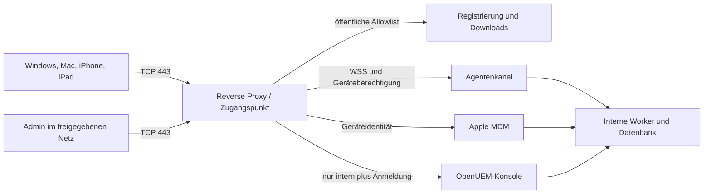

# OpenUEM-Fork: Funktionslücken, Fleet-Abgleich und Ausbauplan

Stand: **7. September 2026**. Geprüfter Implementierungsstand: [`c19a58b`](https://github.com/the-luap/openuem-console/commit/c19a58ba5a54df0f548f8583d0a67cd3da72e30c).

Dieses Dokument beschreibt den Istzustand und die noch erforderliche Arbeit. Es ist keine Zusage, dass die hier vorgeschlagenen Funktionen bereits implementiert sind. Grundlage sind der Quellcode des Forks, aktuelle Primärquellen und eine erneute Browserprüfung der laufenden lokalen Testinstanz. Echte Apple- und Windows-Geräte waren nicht angeschlossen.

## 1. Die wichtigsten Antworten

- **iPadOS ist bereits berücksichtigt.** Das neue Apple-Modul unterscheidet iPads anhand des Modells und unterstützt denselben Inventar-, Profil- und Update-Ablauf wie für iPhones. Eine gesonderte iPad-Abnahme sowie eigene Filter und geeignete Richtlinienvorlagen fehlen.
- **macOS ist noch kein Bestandteil des nativen Apple-MDM-Moduls.** Der Check-in weist Mac-Modelle ab; der Update-Katalog verarbeitet nur die iOS-Gruppe. OpenUEM besitzt daneben bereits einen macOS-Agenten. Agent-Verwaltung und Apple-MDM müssen zu einem Gerät zusammengeführt werden.
- **Ein CSR-Assistent in der App ist sinnvoll und fehlt.** Aktuell müssen Push-Zertifikat und privater Schlüssel hochgeladen werden. Für einen bei Apple verwendbaren MDM-Antrag genügt ein gewöhnlicher CSR nicht: Er benötigt eine MDM-Vendor-Signatur. Diesen Schritt müssen wir in den Ablauf einbauen. [Apple: MDM Vendor CSR Signing Certificate](https://developer.apple.com/help/account/certificates/mdm-vendor-csr-signing-certificate)
- **Du musst für Windows nicht zwingend selbst eine CA mit OpenSSL erstellen.** OpenUEM kann die interne CA bei der Installation erzeugen; eine bestehende Unternehmens-CA ist ebenfalls möglich. Der einfache Assistent dafür gehört zum gewünschten Ausbau. [OpenUEM: Zertifikate](https://github.com/open-uem/openuem-docs/blob/main/docs/07-Advanced%20Topics/05-certificates.md)
- **Ein einziger öffentlich erreichbarer Eingangsport 443 ist ein realistisches Ziel, aber aktuell nicht als Gesamtlösung umgesetzt.** Apple-MDM, Windows-Agent, Downloads und Admin-Anmeldung benötigen ein zusammenhängendes Routing- und Authentifizierungskonzept. Ein Reverse-Proxy-Snippet allein genügt nicht.
- **Die Admin-Oberfläche nur hinter Login anzubieten erfüllt deine Forderung nicht.** Von extern müssen Admin-Routen bereits am Zugangspunkt gesperrt sein; der Dienst muss zusätzlich Anmeldung, Rollen und Mandantenzugriff prüfen.
- **Deutsch existiert im Upstream bereits.** Die neuen Apple-Seiten, Statusmeldungen und Teile der Navigation verwenden jedoch fest eingetragene englische Texte. Die bestehende Übersetzungsinfrastruktur muss vollständig genutzt und geprüft werden.
- **Die UI benötigt Überarbeitung.** Sprachmischung, abweichende Bedienmuster und horizontaler Überlauf sind konkret reproduziert. Auch bestehende OpenUEM-Seiten haben auf kleinen Bildschirmen Fehler.

Codebelege: [Plattformerkennung](../internal/mdm/apple/types.go), [Check-in](../internal/mdm/apple/commands.go), [Apple-Katalog](../internal/mdm/apple/catalog.go), [Apple-Oberfläche](../internal/views/mdm_views/pages.templ), [vorhandene deutsche Übersetzung](../internal/views/locales/de.yaml).

## 2. Status unserer Anforderungen

**Vorhanden** bedeutet implementiert, nicht automatisch auf echten Geräten abgenommen. **Teilweise** bedeutet eine vorhandene Grundlage mit benannten Lücken. **Fehlt** bedeutet im untersuchten Implementierungspfad nicht umgesetzt. **Ungeprüft** bedeutet, dass der Nachweis fehlt und nicht durch eine Behauptung ersetzt werden darf.

| Anforderung | Stand im Fork | Was fehlt |
| --- | --- | --- |
| Windows-Software installieren/deinstallieren | Vorhandene OpenUEM-Workflows | Echter Endpoint-Test; einfacher Paket-/Agent-Download; konsistente Statusführung mit Apple |
| Windows-Inventar und installierte Software | Vorhandene Agent-Funktionen | Geräteabnahme; gemeinsame Filter, Exporte und Compliance-Ansicht |
| Windows-Konfiguration | Agent-Aufgaben für u. a. Registry, MSI, PowerShell, Benutzer/Gruppen | Keine nachgewiesene native Windows-MDM-Strecke mit Enrollment/SyncML/CSP im Fork |
| Windows-Update-Verwaltung | Sicherheits-/Updateinformationen vorhanden | Einheitliche Richtlinien für Fristen, Aufschub, Neustarts und überprüften Erfolg |
| iPhone-Registrierung | Manueller Einmal-Link und `.mobileconfig` | Verständliche öffentliche Registrierungsseite, QR-Code, Wiederaufnahme, ADE |
| iPad-Registrierung | Im selben Apple-Modul enthalten | Abnahme auf iPad; iPad-spezifische Richtlinien und Filter |
| Apple-Hardware, OS/Build, Apps | Für iOS/iPadOS implementiert | Echte Geräteprüfung; Inventarumfang je Registrierungsart erklären; macOS ergänzen |
| Apple-Konfigurationsprofile | Upload, einfache Editoren, Revisionen, Zuweisung, Entfernung, Inventarabgleich | Größerer Vorlagenkatalog, Zielgruppen, Konfliktprüfung, macOS-Unterstützung |
| Apple-OS-Updates | Native DDM-Vorgabe mit Version/Build/Frist für iOS/iPadOS | macOS, Update-Ringe, Gruppen, aussagekräftige Fehler-/Fortschrittsansicht und Hardware-Abnahme |
| macOS-Verwaltung | Upstream-Agent als Grundlage | Native MDM-Registrierung, Profile, DDM, Sicherheitsfunktionen; Agent/MDM zu einem Gerät verbinden |
| Apple-Apps verteilen | Fehlt im neuen Modul | Apps & Books, Lizenzen, Installationsstatus, spätere Self-Service-Ansicht |
| CSR direkt in OpenUEM erstellen | Fehlt | Schlüsselgenerierung, CSR, Vendor-Signatur, Import, Verlängerung, Ablaufwarnungen |
| Deployment hinter Reverse Proxy | Upstream-Konsole unterstützt es grundsätzlich | Durchgängige Konfiguration für Apple-MDM, Agent-WSS, Download und einen externen Port |
| Admin intern, Gerätezugriff öffentlich | Apple-Protokoll und Konsole schon getrennte Listener | Geprüfte externe Allowlist und interne Admin-Regeln; kein direkter Backend-Zugriff |
| Windows-/Mac-Client per Link | Upstream-Installer existieren | In unserer Konsole erzeugter, sicherer, passend konfigurierter Installationslink |
| Apple-Gerät per Link einrichten | Profil-Link existiert für iOS/iPadOS | Deutscher Ablauf mit Erklärungen und Status; macOS-Profil und optionales Agent-Paket |
| Vollständig deutsche Bedienung | Upstream-Katalog vorhanden | Neue Seiten, Fehlertexte, Datumsformate, Installationshilfen und verbleibende Upstream-Lücken |
| Einheitliche, responsive Oberfläche | Gemeinsames Layout vorhanden | Gleiche Komponenten, Aktionsmuster, Pagination, Statusdarstellung; konkrete Darstellungsfehler beheben |
| Sicherheit und Betrieb | TLS, Apple-Geräteidentitäten, verschlüsselte Apple-Secrets, Sessions/2FA vorhanden | Proxy-Vertrauensgrenze, granulare Rechte, sichere Bootstrap-Verteilung, Rotation, Audits und Belastungs-/Angriffstests |

Windows-Belege: [Softwareverteilung](../internal/controllers/webserver/handlers/deploy.go), [Profilaufgaben](../internal/controllers/webserver/handlers/profiles.go), [Sicherheitsansicht](../internal/controllers/webserver/handlers/security.go). Apple-Belege: [Modul](../internal/mdm/apple), [Integration](../internal/controllers/webserver/handlers/apple.go). Die vorhandenen Windows-Aufgaben sind nicht mit Microsofts nativem MDM-Protokoll gleichzusetzen. [Microsoft: MDM-Architektur](https://learn.microsoft.com/en-us/windows/client-management/mdm-overview), [Microsoft: HTTPS/SyncML und CSP](https://learn.microsoft.com/en-us/windows/client-management/windows-mdm-enterprise-settings)

## 3. Was Fleet zusätzlich abdeckt

Verglichen wird das aktuelle Fleet-Angebot einschließlich Premium. **F** = laut Preisseite bereits im kostenlosen Angebot, **P** = Premium-Funktion. Das ist eine Angebotszuordnung, keine Garantie gleicher Funktionen auf jedem Betriebssystem. Ein in GitHub sichtbares Feature ist außerdem nicht automatisch Community-Code. Fleet trennt MIT-lizenzierte und kommerzielle Bestandteile; für eine Übernahme muss die jeweilige Datei geprüft werden. [Fleet-Preisseite](https://fleetdm.com/pricing), [Fleet-Repository und Lizenzhinweis](https://github.com/fleetdm/fleet)

| Fleet-Funktion | Angebot | Relevanz / Lücke in unserem Fork |
| --- | --- | --- |
| Plattformübergreifendes MDM | F | Unser Apple-Modul deckt nur iOS/iPadOS ab; Windows ist agentenbasiert, macOS-MDM fehlt |
| Inventarsuche, Labels, Policies | F | Gemeinsame dynamische Zielgruppen und plattformübergreifende Richtlinien fehlen |
| OS-Einstellungen | F | Apple-Vorlagen und native Windows-CSP-Abdeckung ausbauen |
| DDM-Konfigurationsprofile | F | Unser DDM ist auf OS-Update-Vorgaben begrenzt; kein allgemeiner Deklarationskatalog |
| Skriptausführung | F | Bei OpenUEM bereits als Desktop-Aufgaben vorhanden; gemeinsame Ausführungshistorie verbessern |
| Berichte und Dashboards | F | Upstream-Berichte vorhanden; Apple-Daten und gemeinsame Compliance fehlen |
| API, Webhooks, CLI, GitOps | F | Keine gleichwertige dokumentierte öffentliche Management-API/GitOps-Strecke für das neue Modul |
| SSO | F | OIDC-Grundlage vorhanden; Zugriffskonzept, Rollen und Mandantenrechte vervollständigen |
| Zero-Touch / MDM-Migration | P | Apple-ADE und native Windows-Enrollment-/Migrationsabläufe fehlen |
| Account-basiertes Apple-BYOD | P | Fehlt; manuelle Geräteverwaltung ist kein User Enrollment |
| IdP-Gruppen und Kontosynchronisierung | P | Keine durchgängige Benutzer-Geräte-Gruppenzuordnung |
| Gezielte Gerätegruppen | P | Vorhandene Organisationen/Standorte/Tags nicht als vollständiger Ersatz bewerten |
| Verschlüsselung erzwingen | P | BitLocker-/FileVault-Richtlinien mit Schlüsselhinterlegung fehlen als kompletter Ablauf |
| Recovery Lock | P | macOS-Verwaltung und sichere Geheimnisablage/Rotation dafür fehlen |
| OS-Updates erzwingen | P | iOS/iPadOS-Grundlage vorhanden; macOS und gleichwertige Windows-Steuerung fehlen |
| Conditional Access | P | Keine gemeinsame verifizierte Gerätezustandsintegration |
| Softwareverteilung | P | Windows-Grundlage vorhanden; einheitlicher Katalog und Apple-Verteilung fehlen |
| Self-Service | P | Kein gemeinsamer Benutzerkatalog für freigegebene Software |
| Automatische Behebung / Wartungsfenster | P | Keine gemeinsame Policy→Aktion→Nachweis-Kette |
| Sperren und Löschen | P | Fehlen im nativen Apple-Modul; Windows-Unterstützung gesondert implementieren/prüfen |
| Mandantenbetrieb und Gerätegruppenberichte | P | Organisationen vorhanden; Rechte-Isolation und gemeinsame Berichte nicht fertig |
| Agent-Versionen / privates Update-Repository | P | Upstream-Agent-Updates vorhanden; kontrollierte eigene Release-/Rollback-Strecke prüfen |
| MFA, Rollen, Audit-Protokoll | P | MFA existiert bereits; granulare Rechte und Apple-Audit-UI fehlen |
| Zertifikatsverteilung / SCIM | P | Kein kompletter plattformübergreifender Zertifikats- und Benutzerlebenszyklus |
| Schwachstellenbewertung / CISA KEV | P | Keine nachgewiesene Fleet-äquivalente Risiko- und Patchpriorisierung im untersuchten Fork |

Weitere Fleet-Funktionen sind Live-Abfragen mit osquery, Dateiintegritätsüberwachung, Dateiübernahme für Untersuchungen, benutzerdefinierte Protokollierung und YARA-/IoC-Prüfungen. Diese betreffen vor allem Desktop-Endpunkte; daraus folgt keine frei ausführbare Abfrage- oder Skriptfunktion auf iPhones/iPads. Unser Ausbau sollte diese Security-Analyse getrennt vom zunächst benötigten MDM planen. Die Preisseite kennzeichnet außerdem einzelne Bereiche wie „Application management“, „Binary authorization“ und „Asset discovery“ mit einem Ankündigungsstern; diese sind keine pauschal verfügbare Referenzfunktion. [Fleet-Preisseite](https://fleetdm.com/pricing), [Fleet: Inventar und osquery](https://github.com/fleetdm/fleet)

Die konkreten Plattformunterschiede sind für die Planung wichtiger als die Häkchen der Preisseite:

- **Apple:** Fleet dokumentiert manuelle Registrierung und ADE für macOS/iOS/iPadOS sowie einen CSR-Download im Setup. Apps-&-Books-Anbindung ist zusätzlich vorgesehen. Bei uns fehlen ADE und macOS-MDM. [Fleet: Apple MDM](https://fleetdm.com/guides/apple-mdm-setup)
- **Windows:** Fleet besitzt zusätzlich zum Agenten eine native MDM-Registrierung und Integration mit Entra/Autopilot. Unser bestehender Agent ist eine gute Basis für Softwareverteilung, ersetzt diesen Protokollumfang aber nicht. [Fleet: Windows MDM](https://fleetdm.com/guides/windows-mdm-setup)
- **Updates:** Fleet bietet getrennte Apple-Plattformvorgaben und Windows-Fristen einschließlich Nachfrist; auf macOS auch eine hardwareabhängige neueste Version mit Zeitabstand zur Veröffentlichung. Unser Fork braucht insbesondere Gruppen/Ringe und macOS. [Fleet: OS-Updates](https://fleetdm.com/guides/enforce-os-updates)
- **Software:** Fleet unterstützt eigene Pakete, Installations-/Deinstallationsabläufe, Apple-Store-Apps und Self-Service. Bei uns bestehen Windows-/Homebrew-Grundlagen, aber noch kein gemeinsamer Produktablauf. [Fleet: Pakete](https://fleetdm.com/guides/deploy-software-packages), [Store-Apps](https://fleetdm.com/guides/install-app-store-apps), [Self-Service](https://fleetdm.com/guides/software-self-service)
- **Verschlüsselung:** Fleet verbindet FileVault/BitLocker-Steuerung mit Schlüsselhinterlegung und Überprüfung. Eine vorhandene BitLocker-Inventaranzeige in OpenUEM ist keine solche Verwaltung. iOS/iPadOS benötigen ein eigenes Sicherheitsmodell; FileVault ist eine Mac-Funktion. [Fleet: Verschlüsselung](https://fleetdm.com/guides/enforce-disk-encryption)

## 4. Ausbau je Plattform

### iOS und iPadOS

Die gemeinsame technische Grundlage ist richtig. iPadOS muss als eigenständige Plattform in Filter, Symbole, Berichte und Richtlinienziele aufgenommen werden, ohne den MDM-Server zu duplizieren.

Noch erforderlich:

- Registrierungsart und Verwaltungsfähigkeit ausdrücklich anzeigen: manuell, später ADE, später User Enrollment; zusätzlich beaufsichtigt/nicht beaufsichtigt. Ein manueller Profildownload macht ein Gerät nicht automatisch beaufsichtigt.
- Profilvorlagen mit Version-/Plattformprüfung: WLAN, VPN, Zertifikate, Passcode, Einschränkungen, Webfilter sowie gegebenenfalls Kiosk-/Single-App-Betrieb. Aktuell gibt es einfache Passcode-/WLAN-/Restriktionseditoren und generischen Upload, keinen vollständigen Katalog.
- Profile an Organisationen, Standorte und dynamische Gruppen binden; Vorschau der betroffenen Geräte, Ausschlüsse, Konflikte, Rücknahme auf eine frühere Revision und verständliche Fehlerursachen.
- Updates als Richtlinie für Gruppen statt nur einzelne Geräte; Testgruppe vor breiter Freigabe; Fristen, Ausnahmen, Fortschritt und Eskalation. „Richtlinie aktiv“ und „Zielversion installiert“ bleiben getrennte Zustände.
- Zertifikate automatisch erneuern. Die aktuelle Geräteidentität läuft nach einem Jahr ab; eine erneute Registrierung ist kein dauerhaft einfacher Betriebsablauf.
- ADE/Apple-Business-Anbindung, Token-Verlängerung, Zuordnung, Setup-Assistent und Wiederregistrierung.
- Für spätere BYOD-Nutzung: echter User-Enrollment-Ablauf, eingeschränkter Inventarumfang und transparente Trennung persönlicher Daten.
- Optional danach: Apps & Books, Lizenzzuordnung, App-Updates, Self-Service; Shared-iPad-Szenarien gesondert planen und testen.

Die installierten Apps können nur in dem Umfang angezeigt werden, den Apple für die jeweilige Registrierung meldet. Eine vollständige private App-Liste ist insbesondere bei User Enrollment nicht zu versprechen. [Fleet: Apple-BYOD und Inventargrenzen](https://fleetdm.com/guides/enroll-byod-ios-ipados-hosts), [Apple: Device-Management-Schemata](https://github.com/apple/device-management)

### macOS

**macOS ist ein zusätzlicher Umsetzungsblock, keine bloße Umbenennung von iOS.** Der vorhandene Agent kann als Grundlage für Inventar, Skripte und Homebrew dienen. Die Upstream-Dokumentation beschreibt dafür Homebrew und teilweise Ansible sowie manuelle Konfigurations-/Zertifikatschritte. Das erfüllt den gewünschten einfachen Einstieg noch nicht. [OpenUEM: macOS-Agent](https://github.com/open-uem/openuem-docs/blob/main/docs/02-Installation/02-Agent/03-macos.md)

Erforderlich sind:

1. Mac-Registrierung im nativen Modul zulassen, korrekt erkennen und mit eigenem Funktions-/Versionsmodell speichern. Die heutige Modellprüfung und reine iOS-Katalogauswertung müssen ersetzt werden.
2. Apple-MDM und Agent anhand stabiler Hardwaremerkmale verknüpfen: ein Mac, eine Detailseite, zwei technische Verwaltungskanäle. Konflikte und erneute Registrierung dürfen keine Doppelgeräte erzeugen.
3. macOS-Profile einschließlich geeigneter Kanal-/Benutzerzuordnung unterstützen; MDM-Profile von bestehenden Ansible-Aufgaben unterscheiden.
4. DDM-Updates mit Mac-Katalog, Hardwarekompatibilität und erforderlichen Autorisierungs-/Bootstrap-Token-Abläufen umsetzen. OS-Mindestversionen aus Apples Schemata ableiten und testen.
5. FileVault mit hinterlegtem und überprüftem Wiederherstellungsschlüssel; später Recovery Lock, lokale Admin-Konten/Passwortrotation und Platform SSO.
6. Vorlagen für PPPC/TCC, System Extensions, Firewall, Gatekeeper und Zertifikate; keine pauschale Zusage, jede Benutzerfreigabe umgehen zu können.
7. Signiertes und notarisiertes Agent-Paket, deutscher Installationsablauf, Installation über Link und automatische Konfiguration. Die aktuelle Upstream-Anleitung weist noch auf unsignierte Pakete hin; den konkreten Release-Build vor Übernahme separat prüfen.
8. App-/Paketverteilung vereinheitlichen: vorhandenes Homebrew, eigene PKG-Pakete und später Apps & Books mit überprüfbaren Ergebnissen.

### Windows

Die vorhandene Softwareverteilung weiterverwenden. Eine komplette neue Windows-MDM-Implementierung ist nicht nötig, nur um WinGet/MSI/PowerShell-Aufgaben auszurollen. Für Fleet-ähnliche native Windows-Verwaltung bleibt sie dagegen ein zusätzlicher Arbeitsblock.

Prioritäten:

- Ein freigegebener Installationslink aus der Konsole, automatische Organisations-/Standortzuordnung und individuelle Geräteidentität; keine Zertifikatsdateien von Hand zusammensuchen.
- Standardpakete und eigene Software in einem verständlichen Katalog: Version, Quelle, Architektur, Installationsparameter, Erkennungsregel, Deinstallation, Neustartbedarf und Ergebnis.
- Ausstehend, heruntergeladen, installiert, überprüft und fehlgeschlagen klar unterscheiden; Offline-Geräte, Wiederholung und Paketwechsel testen.
- Update-Richtlinien mit Ringen, Fristen, Aufschub und Neustartkommunikation. Existierende Updateberichte nicht als vollständige Patchsteuerung darstellen.
- BitLocker-Status zu einer Verwaltungsfunktion mit Recovery-Key-Hinterlegung und kontrolliertem Zugriff ausbauen; Defender-/Firewall-Zustand und lokale Administratoren sinnvoll ergänzen.
- Native Windows-MDM-Strecke bei Bedarf vollständig planen: Discovery/Enrollment, Zertifikatsausstellung, DMClient/SyncML, CSP-Ergebnisse, Erneuerung und Abmeldung. Entra/Autopilot sind darauf aufbauende Integrationen.
- Unterstützte Windows-Versionen, Editionen und Architekturen festlegen; Serverbetrieb und auslaufende OS-Versionen separat kennzeichnen.

Microsoft stellt für Windows einen eingebauten MDM-Client bereit. Er ist technisch vom OpenUEM-Agenten zu unterscheiden. Für Win32-Software und detaillierte Verwaltung bleibt der Agent nützlich. [Microsoft: MDM](https://learn.microsoft.com/en-us/windows/client-management/mdm-overview), [CSP-Referenz](https://learn.microsoft.com/en-us/windows/client-management/mdm/)

## 5. Apple-Push-Zertifikat: gewünschter Assistent

### Istzustand

Die App verlangt heute zwei Dateien: Push-Zertifikat und passenden privaten Schlüssel. Sie prüft die Zusammengehörigkeit, das MDM-Topic und die Gültigkeit, verschlüsselt private Schlüssel und verhindert einen Topic-Wechsel bei der Erneuerung. CSR-Erstellung, Vendor-Signatur, geführte Verlängerung und Erinnerungen fehlen. [Code: Konfiguration](../internal/mdm/apple/enrollment.go), [Formular](../internal/views/mdm_views/pages.templ)

### Sollablauf

1. **„Apple-Verwaltung einrichten“:** Organisation und öffentliche Geräteadresse bestätigen.
2. **„Zertifikatsanfrage erstellen“:** Schlüssel sicher innerhalb der eigenen Instanz erzeugen und verschlüsselt speichern; öffentliche Anfrage erzeugen. Kein privater Schlüssel wird an einen Signierdienst übertragen.
3. **Vendor-Signatur beschaffen:** entweder mit eigener von Apple freigeschalteter MDM-Vendor-Berechtigung oder über einen dafür berechtigten Signierdienst. Dessen Verfügbarkeit, Anforderungen und Betrieb müssen vor Implementierung geklärt werden. Eine Fleet-Signierinfrastruktur gehört nicht automatisch zu einem Community-Fork.
4. **„Anfrage für Apple herunterladen“:** eine tatsächlich für das Push-Portal vorbereitete, signierte Anfrage liefern; Apple-Portal in einem neuen Tab öffnen und den nächsten Schritt auf Deutsch erklären.
5. **„Apple-Zertifikat hochladen“:** Nutzer lädt nur das erhaltene Zertifikat hoch. Die App ordnet es dem gespeicherten Schlüssel zu, prüft Inhalt, Ablauf und Topic und führt einen verständlichen Verbindungstest aus.
6. **Verlängern statt neu anlegen:** rechtzeitige Warnungen, verantwortlichen Apple-Account als Verwaltungsinformation speichern, passenden vorhandenen Portal-Eintrag erläutern und Topic-Wechsel verhindern. Alte funktionierende Konfiguration erst nach erfolgreicher Prüfung ersetzen.

Ein **roher PKCS#10-CSR ist nicht der fertige MDM-Push-Portal-Antrag**. Apple beschreibt die erforderliche Vendor-Signierberechtigung ausdrücklich. Fleet zeigt den gewünschten kurzen Benutzerablauf bereits, verbirgt aber die dahinterliegende Signierintegration. [Apple: Signierberechtigung](https://developer.apple.com/help/account/certificates/mdm-vendor-csr-signing-certificate), [Fleet: Setup und Verlängerung](https://fleetdm.com/guides/apple-mdm-setup)

Zusätzliche Anforderungen: nur berechtigte Administratoren dürfen Schlüssel/Anfragen verwalten; offene Anfragen müssen eindeutig zugeordnet und widerrufbar sein; parallele Verlängerungen dürfen keine falsche Schlüsselzuordnung verursachen. Vendor-Schlüssel gehören niemals in Repository, Installer oder öffentliches Downloadpaket.

## 6. Welche Zertifikate brauchen wir wirklich?

| Zweck | Herkunft / Verwaltung | Was darf auf das Endgerät? |
| --- | --- | --- |
| Öffentliches HTTPS für `uem.example.org` | Öffentlich vertrauenswürdige CA, automatisierbar am Proxy | Öffentliche Zertifikatskette; kein Server-Schlüssel |
| Interne OpenUEM-CA für Komponenten/Agenten | OpenUEM-Installation oder vorhandene Unternehmens-PKI | Öffentliches CA-Zertifikat, soweit für Vertrauensprüfung nötig; niemals `ca.key` |
| Individuelle Windows-/Mac-Agent-Identität | Registrierung/CA-Worker; Ziel: automatisch pro Gerät | Nur die eigene Identität, geschützt im lokalen Schlüsselspeicher |
| Apple-Geräteidentität | Im nativen Modul derzeit eigene CA pro Organisation und PKCS#12-Profil | Individuelle Identität; künftig bevorzugt geräteseitige Schlüsselgenerierung und Erneuerung |
| Apple-MDM-Push-Zertifikat | Apple Push Certificates Portal nach signiertem Antrag | Nicht auf Geräte verteilen; Schlüssel bleibt beim MDM-Dienst |
| Installer-Signatur | Code-Signing-Zertifikat für Windows bzw. Apple Developer ID | Signiertes Programm/Paket; niemals der Signierschlüssel |

**Antwort auf die CA-Frage:** Die interne CA wird benötigt, aber ihre Erstellung kann automatisiert werden. Du musst nicht manuell eine CA pro Windows-Gerät anlegen. Ein öffentliches HTTPS-Zertifikat ersetzt nicht automatisch die interne Geräteidentität. Fleet beschreibt für sein natives Windows-MDM eine zusätzliche WSTEP-Identität; diese konkrete Fleet-Konfiguration ist nicht einfach auf unseren agentenbasierten OpenUEM-Pfad zu übertragen. [OpenUEM: interne PKI](https://github.com/open-uem/openuem-docs/blob/main/docs/07-Advanced%20Topics/05-certificates.md), [Fleet: Windows-Zertifikate](https://fleetdm.com/guides/windows-mdm-setup)

Die Upstream-Windows-Anleitung verlangt derzeit `ca.cer`, `sftp.cer`, `agent.cer` und `agent.key` neben dem Installer oder als Installationsparameter. Diesen administrativen Bootstrap-Schritt dürfen wir nicht als öffentlichen Download mit einem dauerhaft gemeinsam verwendeten privaten Schlüssel anbieten. Für den einfachen Link ist ein begrenzter Einladungsnachweis mit anschließend individueller Identitätsausstellung erforderlich. [OpenUEM: Windows-Installation](https://github.com/open-uem/openuem-docs/blob/main/docs/02-Installation/02-Agent/01-windows.md)

## 7. Reverse Proxy, genau ein Eingangsport und gesperrte Admin-Routen

### Zielbild

**Ein öffentlicher TCP-Port 443; mehrere interne Dienste bleiben erlaubt.** Nach außen werden nur die tatsächlich für Geräte notwendigen Routen freigegeben. Interner Admin-Zugriff kann über VPN, ein privates Netz oder einen gesondert abgesicherten Zugang erfolgen. Ein geheimer URL-Pfad ist keine Zugriffskontrolle.

Die folgende Pfadstruktur ist ein **Entwurf**, keine heute einsetzbare Proxy-Konfiguration:

| Route / Dienst | Extern erreichbar? | Regel |
| --- | --- | --- |
| `GET /enroll/<token>` | Ja | Neue öffentliche Hilfeseite; Öffnen allein verbraucht die Einladung nicht |
| `POST /enroll/<token>/claim` | Ja | Neuer begrenzter Registrierungsschritt mit Replay-Schutz |
| `GET /downloads/agent/...` | Ja | Neue freigegebene, signierte Installer; Konfiguration/Einladung getrennt absichern |
| `GET /mdm/apple/enroll/<token>` | Ja | Bestehender Profildownload; Einmaligkeit/Linkscanner-Verhalten verbessern |
| `PUT /mdm/apple/<id>/checkin` und `/connect` | Ja | Bestehende Apple-Protokollrouten; individuelle Geräteauthentifizierung zwingend |
| `/agent-channel` mit WebSocket-Upgrade | Ja | Geplanter Agentenkanal; WSS-Basis vorhanden, Pfad/Authentifizierung/ACLs noch zu integrieren |
| Künftige Windows-MDM-Protokollrouten | Erst nach Umsetzung | Nur die ausdrücklich implementierten Discovery-/Enrollment-/Management-Endpunkte |
| OCSP/CRL, falls von ausgelieferten Identitäten benötigt | Gezielt | Nur erforderliche öffentliche Prüfrouten; Adressen und Erreichbarkeit testen |
| Admin-Seiten, Login, Admin-API und zugehörige Callbacks | Nein, außerhalb freigegebener Netze | Netzwerk-/Proxy-Sperre plus App-Authentifizierung; nicht nur `/admin` sperren |
| PostgreSQL, interne NATS-/Worker-Ports, Monitoring | Nein | Ausschließlich intern |

### Apple: aktuelle technische Grenze

Unser Apple-Handler verlangt das tatsächliche TLS-Clientzertifikat in `r.TLS.PeerCertificates`. Er ignoriert absichtlich vom Client gelieferte Zertifikatsheader. **Wenn ein normaler HTTP-Reverse-Proxy TLS beendet und eine neue TLS-Verbindung zum Backend öffnet, verschwindet die Geräteidentität am Backend.** Einfach `proxy_pass` auf den Apple-Port zu setzen funktioniert deshalb nicht. [Code: Apple-Protokollserver](../internal/mdm/apple/http.go)

Zwei mögliche Umsetzungen:

- **Mehrere Hostnamen auf demselben Port 443:** SNI-/TCP-Passthrough kann Apple-TLS bis zum MDM-Dienst erhalten; Admin-Zugang und Downloads verwenden andere Hostnamen. Vorteil: bestehende Apple-Authentifizierung bleibt erhalten. Grenze: Ein Passthrough-Proxy kann keine verschlüsselten URL-Pfade auswerten. Das ist eine Alternative für „ein Port“, keine Erfüllung von „ein Hostname mit Pfadrouting“.
- **Ein Hostname mit Pfadrouting:** TLS am vertrauenswürdigen Gateway beenden und die geprüfte Geräteidentität sicher an das Backend vermitteln. Dafür brauchen wir eine ausdrücklich implementierte Vertrauensgrenze: nur authentifizierte Gateways, gesperrte Direktzugriffe, entfernte/überschriebene eingehende Identitätsheader, Zertifikats-/Besitzprüfung und Negativtests. Optionales Clientzertifikat auf derselben Domain kann Browserdialoge beeinflussen; mit Safari und Enrollment testen. Ein frei akzeptierter `X-Client-Cert`-Header wäre keine Lösung.

Für dein gewünschtes URL-Konzept ist die zweite Variante der passende Ausbau. Die konkrete Proxy-Software und ihr sicherer Identitätstransport müssen gemeinsam mit der Anwendung festgelegt werden.

### Windows/macOS-Agenten: vorhandenes WSS korrekt weiterverwenden

Die im Fork verwendete OpenUEM-NATS-Bibliothek besitzt bereits einen WebSocket-Fallback. Auch der aktuelle Upstream-Agent liest `WebSocketPort`. Daher **keinen neuen Agententransport von Grund auf bauen**, bevor diese Grundlage genutzt wurde. Der Fallback setzt heute eine URL aus Host und Port zusammen; die gewünschte Pfadkonfiguration, Wiederverbindung, externe Adressen und Authentifizierung sind nicht als fertiges Ein-Port-Deployment nachgewiesen. [NATS-Bibliothek am verwendeten Commit](https://github.com/open-uem/nats/blob/98373a46adcf/connect.go), [Agent-Konfiguration](https://github.com/open-uem/openuem-agent/blob/main/internal/agent/config.go)

WSS kann durch einen HTTP-Proxy laufen. **Auch hier darf TLS-Terminierung die bisherige Clientzertifikatsidentität nicht durch eine gemeinsame Proxy-Identität ersetzen.** NATS-Accounts/Subject-Rechte, individuelle Anmeldung und Zertifikatsrotation müssen erhalten bleiben oder kontrolliert durch eine gleichwertige Anwendungsauthentifizierung ersetzt werden. WebSocket-Unterstützung allein beweist das nicht. [NATS: WebSocket und Proxies](https://docs.nats.io/learn/websocket/)

Zusätzlich zu berücksichtigen:

- Upstream-Proxybeispiele behandeln Konsole/Auth und verwenden teilweise einen separaten Auth-Port. Sie lösen das neue Gesamtziel noch nicht. [OpenUEM: Reverse Proxy](https://github.com/open-uem/openuem-docs/blob/main/docs/07-Advanced%20Topics/02-reverse-proxy.md)
- Aktuelle Admin-Routen liegen auch unter `/tenant/...`, `/computers`, `/deploy`, `/profiles`, `/login` und weiteren Pfaden. Deshalb öffentliche Geräte-Routen erlauben und sonst von extern ablehnen; nicht nur `/admin` blockieren. [Routen](../internal/controllers/webserver/handlers/routes.go), [Apple-Admin-Routen](../internal/controllers/webserver/handlers/apple.go)
- Paketdateien, Updates und gegebenenfalls Zertifikatsstatus müssen über zulässige HTTPS-Routen erreichbar sein. Der bestehende `/download/:filename`-Handler ist ein authentifizierter Verwaltungsdownload, kein fertiges öffentliches Agentenportal.
- SFTP/VNC und direkte Remote-Zugriffe besitzen eigene Netzwerkannahmen. Sie sind nicht durch WSS automatisch abgedeckt. Für einen Betrieb ohne zusätzliche Eingangsports auf Endgeräten müssen diese Funktionen deaktiviert oder über einen gezielten Rückkanal/VPN umgesetzt werden.
- Öffentliche Basis-URL, Weiterleitungen, Cookies, Origin-/CSRF-Prüfung, Uploadgrenzen, WebSocket-Zeitlimits, IPv6 und Proxy-Header zusammen testen.
- Nur ein **eingehender Serverport** bedeutet nicht, dass Apple-Dienste entfallen. Server und Geräte benötigen ausgehende Verbindungen zu APNs sowie zu Apple-/Microsoft-/Paketdiensten. Apple nennt insbesondere 5223 für Geräte-Push-Verbindungen und 443 als Ausweichweg; unser Server sendet APNs-Anfragen über 443. [Apple: Push-Netzwerk](https://support.apple.com/en-us/102266)
- Für automatische öffentliche TLS-Zertifikate kann DNS-01 die zusätzliche Freigabe von Port 80 vermeiden; das konkrete Verfahren ist Teil der Deployment-Konfiguration.

## 8. Einfacher Download und verständliche Registrierung

### Windows

Gewünschter Ablauf: **Organisation/Standort auswählen → Installationslink erzeugen → Link auf Windows öffnen → signierten Installer starten → Administratorfreigabe → Gerät erscheint mit Registrierungsstatus.**

Es fehlen ein öffentlicher Download-/Registrierungsdienst und eine passende Paket-/Konfigurationsstrecke. Der Installer darf nicht durch nachträgliches Einbetten von Daten seine Signatur verlieren. Geeignet sind ein unverändert signierter Installer mit signiertem Konfigurationsmanifest oder ein eigenständig signierter Bootstrapper. Architektur, erlaubte Version und Herkunft müssen geprüft werden. Einladungen bekommen Ablaufzeit, Widerruf und begrenzte Verwendung; Kopieren eines Links darf keine dauerhafte universelle Identität verteilen.

Stille Installation weiterhin anbieten, aber hinter „Erweiterte Bereitstellung“ mit einem kopierbaren Befehl und ohne langfristige Geheimnisse in Befehlszeile, Prozessliste oder Logs. Standardnutzer benötigen bei einer Systeminstallation weiterhin die vom Betriebssystem geforderte Freigabe.

### iPhone/iPad

Kein Desktop-Agent erforderlich: **Link oder QR-Code → deutsche Informationsseite → Profil laden → Installation in den Einstellungen bestätigen → Registrierungsstatus sehen.** Der aktuelle Direktdownload ist die technische Grundlage, aber kein vollständiger Benutzerablauf. Keine Behauptung einer stillen manuellen Registrierung; für weitgehend automatische Firmengeräte-Einrichtung ist ADE vorgesehen.

Ein GET durch Mail-/Linkscanner darf die eigentliche Einladung nicht unbemerkt verbrauchen. Fehler wie abgelaufener Link, bereits verwendet, ungeeignetes Gerät und fehlende Netzwerkverbindung müssen verständlich erklärt werden. Ein begrenzter Wiederholungsablauf ist gegen die Einmaligkeit und den Schutz der Geräteidentität abzuwägen.

### Mac

Eine Seite erklärt getrennt und verständlich **Geräteverwaltung aktivieren** und **OpenUEM-Agent installieren**. Das Profil aktiviert native Apple-Funktionen; das signierte Agent-Paket ergänzt Softwareverteilung und Inventar. Beide melden sich anschließend als derselbe Mac in der Konsole. Bei ADE soll diese Einrichtung weitgehend im ersten Setup erfolgen.

## 9. Konkrete UI-Befunde und deutsche Übersetzung

Browserprüfung am 07.09.2026: tatsächliche Docker-Konsole mit PostgreSQL/NATS und synthetischem Gerät; Desktopbreite 1440 px sowie mobile Breite 390 px. Kein statisches Mockup. Das Desktop-Setup wurde auch per Screenshot geprüft.

| Befund | Beleg / Auswirkung | Erforderliche Änderung |
| --- | --- | --- |
| Deutsch/Englisch gemischt | Deutsche Organisationsauswahl und native Menüs, daneben „Apple setup & enrollment“, englische Formulare/Status | Alle neuen Texte in bestehende Locale-Dateien übernehmen; restliche Upstream-Lücken mitprüfen |
| Navigationsmodell uneinheitlich | Separate Buttonleiste für Apple; „Windows profiles“ und „iOS profiles“ führen in unterschiedliche Bedienabläufe | Gemeinsame Navigation, Plattformfilter, einheitliche Aktionen und richtige aktive Zustände |
| Tabellen-/Listenfunktionen unterschiedlich | Native Computeransicht hat Pagination/Sortierung/Exporte; neue Übersicht lädt und sortiert zusammengeführte Listen ohne gleichwertige Bedienung | Gemeinsame serverseitige Filter/Pagination; Exporte und Bulk-Aktionen konsistent |
| Datum/Status nicht lokalisiert | `When()` formatiert fest in UTC; `StateLabel()` liefert Englisch | Lokalisierte Anzeige mit klarer Zeitzone; Apple-Updatefrist weiterhin ausdrücklich in Geräte-Ortszeit |
| Setup ohne Führung | PEM-Dateien, privater Schlüssel und technische Serverparameter direkt im Hauptformular | CSR-Assistent, Gesundheitsprüfung und Details unter „Erweitert“ |
| Technische Push-Fehler sichtbar | Geräteansicht zeigt im Test eine komplette APNs-URL mit Token und Verbindungsfehler | Kurze deutsche Ursache, nächste Aktion; sensible Teile redigieren, technische Details kontrolliert anbieten |
| Update-Zusammenfassung unvollständig | Auswahl enthält Version/Build, Zusammenfassung zeigt nur Version/Frist | Gewählten Build ebenfalls anzeigen; Richtlinienaktivität und tatsächlichen OS-Stand klar trennen |
| Mobile Überläufe | Siehe Messwerte unten | Header, Tabellen, lange Tokens/URLs, Formulare und Aktionsleisten überarbeiten |

Gemessene Dokumentbreite bei **390 px Viewport**:

| Seite | Dokumentbreite | Beobachtung |
| --- | --- | --- |
| Apple-Setup | 630 px | Überlauf außerhalb des eigentlichen Hauptformulars; gemeinsamen Seitenrahmen mitprüfen |
| Gemeinsame Geräteübersicht | 630 px | Tabellen besitzen zusätzlich horizontales Scrollen; kein Ersatz für fehlerfreien Seitenrahmen |
| Apple-Gerätedetails | 889 px | Zusätzlicher Überlauf in Detail-/Historienbereich |
| Apple-Profile | 630 px | Aktions-/Revisionsbereich ragt zusätzlich über die nutzbare Breite |
| Native Computeransicht | 649 px | Auch Upstream-Aktions-/Aktualisierungsleiste zu breit |

Diese Messwerte belegen Darstellungsfehler, jedoch keine vollständige Prüfung aller Browser, Themes und Datensätze. Die Apple-Seiten verwenden bereits das gemeinsame Layout und vorhandene CSS-Klassen; es fehlt keine komplette Stylesheet-Einbindung. Die Aufgabe ist die konsequente Nutzung und Korrektur der gemeinsamen Komponenten.

Für Deutsch umzusetzen:

- Neue Schlüssel etwa unter `mdm.*`, `enrollment.*`, `certificates.*` und `updates.*` in `de.yaml` und `en.yaml`; keine zweite Übersetzungsbibliothek.
- Backend-Validierungen, Toasts/Fehler, Status, Breadcrumbs, Tabellen, Leerzustände, Hilfetexte und öffentliche Registrierungsseiten einbeziehen.
- Sprache optional im Nutzerprofil wählbar; Browser-`Accept-Language` als Vorgabe. Aktuell stammt die Auswahl aus dem Request-Header.
- Einheitliche Begriffe, etwa „Geräte“, „Registrierung“, „Konfigurationsprofile“, „Auf Gerät überprüft“, „Aktualisierung erforderlich“ und „Zertifikat verlängern“.
- Datums-/Zahlenformate, Pluralformen, Tastaturbedienung, Fokus, Kontrast, lange deutsche Texte und Bildschirmleser testen; keine Fachwörter nur durch andere unverständliche Fachwörter ersetzen.
- Windows-/Mac-Installer und Installationsanleitungen in die Sprachabnahme aufnehmen. Der tatsächliche Installer-Sprachumfang muss am eingesetzten Release geprüft werden.

Code: [Locale-Einbindung](../internal/views/locales/locales.go), [Sprachauswahl](../internal/controllers/router/middleware/i18n.go), [Apple-Viewmodel](../internal/views/mdm_views/viewmodel.go), [native Computeransicht](../internal/views/computers_views/computers_views.templ).

## 10. Sicherheitsbefunde und Freigabekriterien

Dies ist ein gezielter Code-/Architekturreview, kein vollständiger Penetrationstest. Bestätigte Eigenschaften, konkrete Review-Befunde und noch zu testende Risiken werden getrennt behandelt.

Bereits vorhanden: individuell gebundene Apple-Geräteidentitäten mit TLS-Besitznachweis, ablaufende Einmal-Einladungen, verschlüsselte private Apple-Schlüssel/Profile, getrennte öffentliche Protokollrouten, Apple-spezifischer CSRF-Vergleich, Upload-/Request-Limits und serverseitige Mandanten-/Standortfilter. Sessions, OIDC und 2FA existieren aus OpenUEM. Diese Grundlagen dürfen beim Proxy-/UX-Umbau nicht verloren gehen.

| Priorität | Befund / offene Prüfung | Erforderlicher Nachweis |
| --- | --- | --- |
| P0 | Apple-Geräteauthentifizierung wird durch gewöhnliche TLS-Terminierung unterbrochen | Gültiges Gerät funktioniert durch den gewählten Proxy; falsches Zertifikat, gespoofter Header, Replay und direkter Backend-Zugriff werden abgewiesen |
| P0 | Bestehender Admin-Auth-Handler akzeptiert ersatzweise `Client-Cert`; dort ist keine Herkunftsprüfung des Headers zu sehen | Header ausschließlich von authentifiziertem Proxy akzeptieren oder Pfad entfernen; Netzwerkisolation und Negativtests. Ein öffentliches Zertifikat allein ist kein Besitznachweis |
| P0 | `IsAuthenticated` prüft Session/2FA, aber keinen granularen Apple-Aktionszugriff | Serverrollen und Mandanten-/Standortrechte bei jeder Aktion; Lesezugriff darf keine Profile, Updates oder Zertifikate ändern |
| P0 | Gewünschte öffentliche Installer dürfen keine gemeinsame dauerhafte Agentenidentität verteilen | Begrenzter Bootstrap, individuelle Schlüssel, begrenzte NATS-Rechte, Rotation und Widerruf |
| P0 | Admin-Sperre ist bisher kein geprüftes Deployment-Merkmal | Von außen alle Admin-Routen einschließlich Alias-/Tenant-Routen gesperrt; über zugelassenen internen Zugang funktionsfähig |
| P1 | Apple-Geräteidentität läuft nach einem Jahr ab; keine automatische Erneuerung | Erneuerung vor Ablauf ohne Verlust von Verwaltung, Zuordnung und Historie |
| P1 | Globale CSRF-Konfiguration verwendet `TokenLookup: cookie:_csrf`; Apple hat zusätzlichen Formularvergleich | Übrige mutierende Routen mit echten Cross-Site-/Origin-Tests prüfen und wirksamen Request-Token-Abgleich vereinheitlichen; kein Exploitnachweis aus diesem Review ableiten |
| P1 | Öffentlicher Apple-Handler besitzt Limits/Timeouts, aber keinen eigenen sichtbaren Rate-Limiter | Registrierungs-/DoS-Limits am Gateway und in der App; legitime Geräte, Retry und viele gleichzeitige Check-ins bleiben funktionsfähig |
| P1 | Fehlertexte und Access-Logs können Geräte- oder Enrollment-Tokens enthalten | Redigierte Fehler/Logs, kein Referrer-Leak, `no-store`, kein öffentliches Caching oder Drittanbieter-Tracking auf Enrollment-Seiten |
| P1 | Apple-Audit liegt in Datenbank; Viewer/Retention fehlen | Wer hat was für welche Geräte geändert, mit Ergebnis und Zeit; geschützter Export und definierte Aufbewahrung |
| P1 | Schlüssel-/CA-Rotation und Wiederherstellung nicht als fertiger Ablauf nachgewiesen | Verschlüsselte Backups, getrennte Schlüsselaufbewahrung, Restore-Test und dokumentierte Rotation ohne Geräteverlust |
| P1 | Paket-/Skriptverteilung hat hohe Rechte auf Endgeräten | Signatur-/Hashprüfung, kontrollierte Quellen, sichere URL-/Downloadverarbeitung, Rollen, Audit, begrenzte Ausführung und prüfbare Ergebnisse |
| P1 | Bestehende Gesamt-Tests haben bekannte Upstream-SMTP-/User-Abweichungen | Vor Produktionsfreigabe bewerten/beheben; grüne Teil-CI nicht als vollständigen Sicherheitsnachweis verwenden |

Belege: [Apple-HTTP/TLS](../internal/mdm/apple/http.go), [Apple-Identität](../internal/mdm/apple/enrollment.go), [Apple-Admin-Schutz](../internal/controllers/webserver/handlers/apple.go), [Session/2FA](../internal/controllers/webserver/handlers/routes.go), [Admin-Zertifikatsheader](../internal/controllers/authserver/handlers/auth.go), [globales Routing/CSRF](../internal/controllers/router/router.go), [bekannte Testgrenzen](native-ios-operations.md).

Zusätzliche Abnahmefälle: fremde Mandanten-IDs, doppelte Kommandos, widerrufene/abgelaufene Zertifikate, manipulierte Profile, zu große Dateien, nicht verfügbare Katalogziele, lange Offline-Zeiten, Prozessneustarts und parallele Änderungen. Sicherheitskritische Aktionen brauchen eine verständliche Bestätigung mit Ziel und Auswirkung. Inventarzugriffe und spätere Recovery-Key-Abfragen müssen protokolliert werden.

## 11. Priorisierter Umsetzungsplan

**P0:** Voraussetzung für die sichere gewünschte Bereitstellung. **P1:** erforderlicher Funktions-/Bedienumfang. **P2:** Ausbau zur Fleet-ähnlichen Tiefe. Die Reihenfolge bedeutet nicht, dass P2 bereits zugesagt oder implementiert ist.

| ID | Priorität | Arbeitspaket | Fertig, wenn … |
| --- | --- | --- | --- |
| NET-01 | P0 | Ein-Port-Architektur und Proxy-Vertrauen | Eine dokumentierte Referenzinstallation nur 443 veröffentlicht; Geräte funktionieren, Admin ist von extern gesperrt |
| SEC-01 | P0 | Admin-/Geräteauthentifizierung und Rollen | Proxy-Header-Spoofing, Direktzugriff und unzulässige Aktionen scheitern in Integrationstests |
| ENR-01 | P0 | Sicherer Bootstrap für Agenten | Einladungslink erzeugt genau berechtigte individuelle Identitäten; kein universeller privater Schlüssel im Download |
| APP-01 | P1 | CSR-/Push-Zertifikatsassistent | Anfrage in der App erzeugen, Vendor-Signatur erhalten, bei Apple verwenden, nur Zertifikat importieren und erfolgreich verlängern |
| UX-01 | P1 | Deutsche Sprache und gemeinsame Komponenten | Kernabläufe vollständig deutsch; responsive Desktop-/Tablet-/Mobilabnahme ohne Seitenüberlauf |
| ENR-02 | P1 | Öffentliches Registrierungs-/Downloadportal | Windows, Mac, iPhone und iPad haben verständliche Link-Abläufe mit Status, Ablauf/Widerruf und sicheren Wiederholungen |
| MAC-01 | P1 | macOS-MDM und Geräteverknüpfung | Ein echter Mac erscheint einmal mit MDM/Agent-Status, Inventar und funktionierendem Profillebenszyklus |
| MAC-02 | P1 | macOS-Updates und Sicherheitsgrundlagen | DDM-Update auf echter Hardware; FileVault-Grundablauf und erforderliche Token-Verwaltung nachgewiesen |
| IOS-01 | P1 | iPad-Abnahme, Profil-/Update-UX | iPhone und iPad getrennt getestet; verständliche Richtlinien und verifizierte Resultate |
| WIN-01 | P1 | Windows-Deployment vervollständigen | Standard- und eigenes Paket per Konsole installieren/deinstallieren; Offline-/Neustart-/Fehlerfälle korrekt |
| PKI-01 | P1 | Erneuerung, Backup, Ablaufwarnungen | Bestehende Geräte bleiben nach Zertifikatswechsel und Wiederherstellung verwaltbar |
| OPS-01 | P1 | Eigene Release-/Installationsstrecke | Versionierte, signierte Artefakte, sichere Updates, Monitoring und nachvollziehbare Betriebsanleitung |
| APP-02 | P2 | ADE/Apple Business und Gruppen/Ringe | Automatisches Setup und gruppenweise Richtlinien inklusive Wiederregistrierung funktionieren |
| WIN-02 | P2 | Native Windows-MDM-/CSP-Strecke | Enrollment, Richtlinien, Updates, Zertifikatsrenewal und Abmeldung funktionieren; Entra/Autopilot separat geprüft |
| SEC-02 | P2 | Erweiterte Compliance/Sicherheit | Recovery-Keys, zusätzliche Richtlinien, Schwachstellenpriorisierung und Audit-Export vereinheitlicht |
| API-01 | P2 | Öffentliche API, Webhooks, GitOps | Derselbe gewünschte Zustand kann per UI und versionierter API beschrieben und überprüft werden |
| SW-01 | P2 | Apple-Apps und Self-Service | Apps & Books/Lizenzen sowie ausgewählte eigene Pakete mit Status-/Update-Lebenszyklus; iOS-Apps bleiben nachrangig |

**Betroffene Repositories:** Der aktuelle Fork betrifft die Konsole. Agent-Bootstrap, Installer, Agent-Updates, NATS-/Worker-Konfiguration und PKI liegen teilweise in weiteren OpenUEM-Repositories. Für eine komplette eigene Distribution müssen passende Änderungen dort ebenfalls versioniert werden; sie lassen sich nicht zuverlässig nur durch neue Console-Seiten ersetzen. Relevante Projekte: [Agent](https://github.com/open-uem/openuem-agent), [Worker](https://github.com/open-uem/openuem-worker), [NATS-Bibliothek](https://github.com/open-uem/nats), [Cert-Manager](https://github.com/open-uem/openuem-cert-manager), [Docker-Deployment](https://github.com/open-uem/openuem-docker), [Agent-Updater](https://github.com/open-uem/openuem-agent-updater).

## 12. Abnahme und aktueller Lieferstatus

Die bisherige Implementierung mit nativer iOS/iPadOS-Verwaltung liegt im [Draft-PR #1](https://github.com/the-luap/openuem-console/pull/1). Die [CI für den geprüften Commit](https://github.com/the-luap/openuem-console/actions/runs/34159905065) ist erfolgreich. Sie deckt Protokoll-/Datenbank-/TLS-/UI-Tests, Race-Prüfungen, Windows-Deployment-Modelle und Linux-/Windows-Builds ab. Sie prüft weder ein echtes iPhone/iPad noch einen Mac oder eine Windows-Installation hinter dem gewünschten Proxy.

Für das **nun erweiterte Ziel** reicht die frühere Aussage „es fehlt nur noch die Geräteabnahme“ nicht mehr: macOS-MDM, CSR-Assistent, sicheres Ein-Port-Deployment, einfacher Agenten-Bootstrap, deutsche UI und die aufgeführten Sicherheits-/Bedienungsarbeiten fehlen zusätzlich.

Verbindliche Endabnahme:

- [ ] Eine frische Installation ist ohne manuell zusammengesuchte Zertifikatsdateien verständlich einrichtbar.
- [ ] Nur TCP 443 ist von außen zur Installation erreichbar; alle erforderlichen Gerätefunktionen arbeiten darüber.
- [ ] Admin-Oberfläche und Admin-API sind extern gesperrt und intern mit korrekten Rollen verwendbar.
- [ ] CSR-Assistent und Apple-Zertifikatsverlängerung funktionieren mit echtem Apple-Zertifikat.
- [ ] Windows-Agent lässt sich per Link installieren, individuell registrieren und aktualisieren.
- [ ] Echte Windows-Software wird installiert, überprüft und deinstalliert.
- [ ] iPhone und iPad registrieren sich per Link; Inventar und Profilrevision/-entfernung stimmen.
- [ ] Ein Mac besitzt eine gemeinsame Agent-/MDM-Ansicht mit funktionierenden Profilen und OS-Inventar.
- [ ] OS-Update-Vorgaben werden auf geeigneter echter Apple-Hardware einschließlich Neustart überprüft.
- [ ] Zertifikatserneuerung und Backup-Wiederherstellung erhalten vorhandene Registrierungen.
- [ ] Alle Kernabläufe sind deutsch, verständlich, mit Tastatur bedienbar und auf 390/768/1440 px sinnvoll nutzbar.
- [ ] Sicherheits-Negativtests und Betrieb unter Offline-/Neustart-/Parallelitätsbedingungen bestehen.

Android bleibt ausdrücklich außerhalb des gewünschten Umfangs. iOS/iPadOS-App-Verteilung und weitergehende Fleet-Security-Analyse sind nachrangige Ausbaustufen, keine Voraussetzung für die zuerst geforderten Profil-, Inventar- und Softwareverteilungsabläufe.
